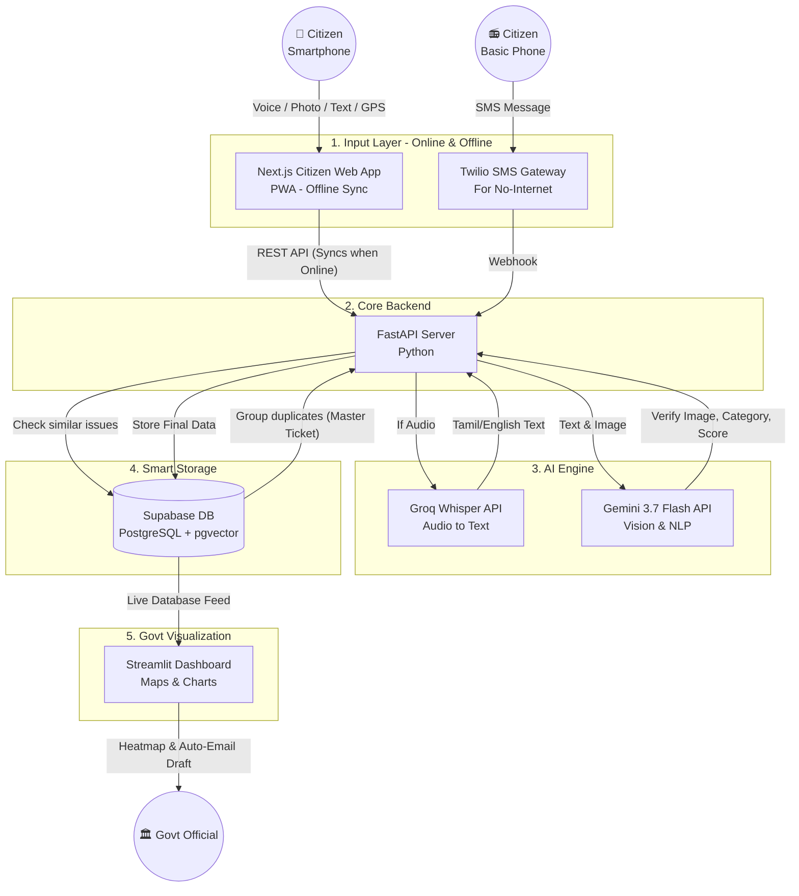

# 🚀 Infra-Pulse: AI for Digital Public Infrastructure & Governance
**Hackathon Project Blueprint**

---

## 📖 The Story (Eppadi Work Aaguthu?)

Ithu verum data entry app kidayathu. Ithu oru smart AI Assistant. Ithu eppadi work aaguthu nu oru chinna story moolama paakalam:

### Scene 1: The Citizen Experience (Ravi-oda prechanai)
Ravi road-la poyittu irukkaru, anga oru periya water pipe burst aagi thanni leak aaguthu. 
1. Ravi udane namma **Next.js Web App**-a open pandraru. (Net illana kooda **PWA Offline Sync** moolama app open aagum).
2. Avar type panna virumbala, so **Mic button**-a amukki Tamil-la pesuraru: *"Koramangala 4th block-la pipe odanjiduchu."* (**Groq Whisper API** atha udane text-a mathiruthu).
3. App "Upload Photo" nu kekuthu, Ravi antha leak aagura pipe-a photo eduthu poduraru.
4. Location-ku **"Use GPS"** amukkuraru, exact location fetch aaguthu. (Veetula iruntha 'Manual Address' type pannalam).
5. Submit amukkuraru. Vela mudinjithu! *(Smartphone illatha makkal just oru SMS anuppi kooda complain pannalam via Twilio)*.

### Scene 2: The AI Magic (Backend-la nadakkura ragasiyam)
Ravi screen-la 'Loading' aagum pothu, namma **FastAPI Backend**-la magic nadakkum:
1. **Photo Verification:** **Gemini 3.7 Vision API** antha photo-va analyze panni, *"Yes, ithu unmaiyana water pipe damage thaan. Severity: HIGH"* nu verify pannidum.
2. **Smart Deduplication:** Ippa data **Supabase (pgvector)**-ku pogum. AI check pannum: *"Intha area-la vera yaru complain pannangala?"*. Aama, already 4 peru complain pannirukanga! So puthusa ticket open pannama, pazhaya ticket koodave ithayum join panni, **"Master Ticket"** aaki severity score-a innum athigam aakkidum.

### Scene 3: The Government Action (Officer Dashboard)
1. Govt Officer avaru system-la **Streamlit Admin Dashboard**-a open pandraru.
2. Map-la Koramangala area-la oru periya **Sivappu (RED) glow** aaguthu. Officer atha click pandraru.
3. Athula *"Master Ticket: Reported by 5 Citizens"* nu irukku. Koodave AI-verified Photo-vum irukku.
4. Officer keela irukka **"Generate Action Plan"** button-a click pandraru.
5. Gemini AI automatic-a oru Official Order email-a draft pannuthu: *"To Contractor: Urgent pipe burst at Koramangala. AI verified. Dispatch team immediately."* Officer 'Send' amukkuna vela mudinjithu!

---

## 🏗️ The Master Architecture Flowchart

---

## 💻 The Top-Notch Tech Stack

*   **Frontend (Citizen App):** Next.js (React), Tailwind CSS, Shadcn UI.
*   **Offline Sync:** PWA (Progressive Web App) architecture.
*   **Backend Server:** FastAPI (Python).
*   **AI Engine:** Gemini 3.7 Flash API (Vision + NLP), Groq Whisper API (Voice-to-Text).
*   **Database:** Supabase (PostgreSQL with `pgvector` for smart deduplication).
*   **Govt Admin Dashboard:** Streamlit (Python) + Folium/Mapbox for interactive Heatmaps.
*   **Offline Fallback:** Twilio SMS API integration (Optional for demo).

---

## 👥 8-Day Sprint & Work Split

### 👨‍💻 Member 1: The Voice AI & Frontend Pro
*Focus: Citizen Web App, Offline PWA, Voice-to-Text integration.*
*   **Day 1-2:** Next.js project setup, Tailwind UI, and Groq Whisper API connection (Tamil voice -> Text).
*   **Day 3-4:** Citizen Form UI (Camera + GPS) & PWA Offline Sync via IndexedDB.
*   **Day 5:** Connect Citizen App to FastAPI endpoints (`/api/reports`).

### 🧠 Member 2: The Vision AI & Backend Architect
*Focus: Backend, Database, AI Vision, Streamlit Dashboard.*
*   **Day 1-2:** FastAPI setup, Supabase DB models, and Gemini Vision API testing (damage severity).
*   **Day 3-4:** Smart Deduplication logic (pgvector) and Action Plan GenAI prompt engineering.
*   **Day 5:** Streamlit Admin Dashboard build (Heatmaps on Mapbox).

### 🚀 Integration & Polish (Both Members)
*   **Day 6:** Integration Day (Ravi Scenario). Full End-to-End test. Voice + Photo from Member 1 appears on Member 2's Map.
*   **Day 7:** UI animations, mock data seeding for the demo.
*   **Day 8:** 2-minute demo video recording and Pitch Deck prep. Hackathon Ready! 🏆

---

## 🔌 API Contract (Endpoints)

### 🟢 1. Citizen App Endpoints
*   **`POST /api/v1/reports`** : Submit a new complaint (Accepts `multipart/form-data` for image, text, location). AI verifies image and deduplicates.
*   **`GET /api/v1/reports/{ticket_id}`** : Check the status of a specific complaint.

### 🔴 2. Govt Admin Dashboard Endpoints
*   **`GET /api/v1/admin/reports/master`** : Fetch clustered "Master Tickets" to plot heatmaps on the map.
*   **`GET /api/v1/admin/reports/master/{master_ticket_id}/details`** : View individual citizen reports grouped under a master ticket.
*   **`POST /api/v1/admin/reports/{master_ticket_id}/action-plan`** : Generate an automated AI email/action plan for the contractor.
*   **`PUT /api/v1/admin/reports/{master_ticket_id}/status`** : Update ticket status (e.g., to "Resolved").

### 🔵 3. Webhooks & System
*   **`POST /api/v1/webhooks/twilio/sms`** : Twilio webhook to receive offline SMS complaints from feature phones.
*   **`GET /api/v1/health`** : Server health check.
